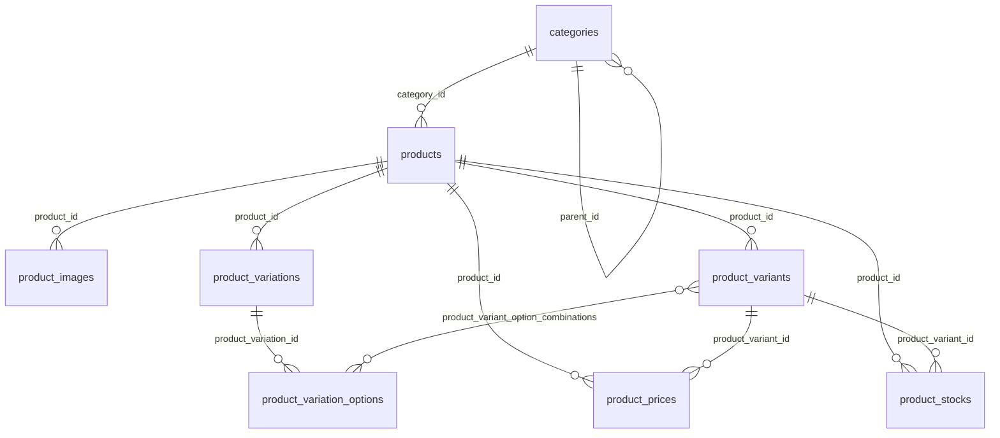

# Code Wiki (Repository Documentation)

## 1) High-Level Overview

This repository is a Laravel (PHP 8.3) ecommerce admin console built as an Inertia-driven SPA using Svelte 5 and Tailwind CSS. The backend is a conventional Laravel HTTP application and the frontend lives in `resources/js` as Inertia pages and Svelte components.

Core functional areas currently implemented:

- Authentication (session-based) with role-based redirects
- Admin console area (`/admin/*`) for:
  - Products (CRUD + variants, images, pricing/stock/shipping bulk management)
  - Categories (tree structure with reordering)
  - Store settings (key/value configuration + logo upload)
  - Master data (admins, customers, roles)

## 2) Technology Stack

### Backend

- Laravel v13 ([composer.json](file:///Users/macbookair/Documents/website/burningroom/ecommerce/ecommerce/ecommerce/composer.json))
- Inertia server adapter: `inertiajs/inertia-laravel` v3
- Auth token package present: `laravel/sanctum` v4 (API route exists but primary auth is session-based)
- Roles & permissions: `spatie/laravel-permission` v7
- Testing: Pest v4 + PHPUnit v12
- Formatting: Laravel Pint

### Frontend

- Inertia client adapter: `@inertiajs/svelte` v3
- Svelte v5
- Vite (with Laravel + Inertia plugins): [vite.config.ts](file:///Users/macbookair/Documents/website/burningroom/ecommerce/ecommerce/ecommerce/vite.config.ts)
- Tailwind CSS v4 via `@tailwindcss/vite`
- Wayfinder: typed route generation for TS, paired with Laravel routes/controllers

## 3) Architecture (Request → Response Flow)

The main HTTP flow for web pages:

1. **Route** is matched (mostly in [web.php](file:///Users/macbookair/Documents/website/burningroom/ecommerce/ecommerce/ecommerce/routes/web.php)).
2. **Controller** loads data with Eloquent and returns an Inertia response (`Inertia::render()`).
3. **Inertia middleware** attaches global props (`auth.user`, theme colors, tax settings) via [HandleInertiaRequests](file:///Users/macbookair/Documents/website/burningroom/ecommerce/ecommerce/ecommerce/app/Http/Middleware/HandleInertiaRequests.php#L37-L58).
4. **Frontend** mounts Inertia in [app.ts](file:///Users/macbookair/Documents/website/burningroom/ecommerce/ecommerce/ecommerce/resources/js/app.ts) and renders a Svelte page from `resources/js/pages`.

```mermaid
flowchart LR
  Browser -->|GET /admin/products| Routes[routes/web.php]
  Routes --> Controller[Controller method]
  Controller --> Eloquent[Eloquent models + DB]
  Controller -->|Inertia::render(Page, Props)| InertiaResponse
  InertiaResponse --> Middleware[HandleInertiaRequests::share]
  Middleware --> Browser
  Browser --> Svelte[Svelte page resources/js/pages/...]
```

## 4) Repository Layout

Key directories:

- `app/`
  - `Http/Controllers/` — controllers grouped into `Admin/` and `Auth/`
  - `Http/Middleware/` — Inertia shared props middleware
  - `Models/` — Eloquent models for catalog/config/auth
  - `Providers/` — app boot configuration hooks
- `routes/`
  - `web.php` — primary UI routes (public + admin)
  - `api.php` — minimal Sanctum-protected route
- `resources/`
  - `js/app.ts` — Inertia bootstrap (client entry)
  - `js/pages/` — Inertia page components (Svelte)
  - `js/components/` — shared layouts and UI components
  - `js/routes/` — Wayfinder-generated typed route functions
  - `views/app.blade.php` — root Inertia HTML template
- `database/`
  - `migrations/` — schema definitions
  - `seeders/` — roles/users bootstrap data
- `tests/` — Pest tests (currently example scaffolds)

## 5) Major Modules and Responsibilities

### 5.1 Authentication & Access

- Routes:
  - Guest login: `GET /login`, `POST /login` ([web.php:L12-L15](file:///Users/macbookair/Documents/website/burningroom/ecommerce/ecommerce/ecommerce/routes/web.php#L12-L15))
  - Logout: `POST /logout` ([web.php:L17-L19](file:///Users/macbookair/Documents/website/burningroom/ecommerce/ecommerce/ecommerce/routes/web.php#L17-L19))
- Controller:
  - [LoginController](file:///Users/macbookair/Documents/website/burningroom/ecommerce/ecommerce/ecommerce/app/Http/Controllers/Auth/LoginController.php)
    - `show()` returns `Auth/Login` Inertia page.
    - `authenticate()` performs session auth with `Auth::attempt()` and redirects:
      - Users with role `Admin` → `/admin/dashboard`
      - Others → `/`
    - `logout()` invalidates the session and redirects to `/login`.
- Roles:
  - Provided by Spatie Permission via [User](file:///Users/macbookair/Documents/website/burningroom/ecommerce/ecommerce/ecommerce/app/Models/User.php) using `HasRoles`.
  - Default roles and users are seeded by [RoleAndUserSeeder](file:///Users/macbookair/Documents/website/burningroom/ecommerce/ecommerce/ecommerce/database/seeders/RoleAndUserSeeder.php).

### 5.2 Admin Area Shell

- Route group: prefix `/admin`, name prefix `admin.`, requires `auth` ([web.php:L21-L58](file:///Users/macbookair/Documents/website/burningroom/ecommerce/ecommerce/ecommerce/routes/web.php#L21-L58)).
- Dashboard:
  - [AdminDashboardController::index](file:///Users/macbookair/Documents/website/burningroom/ecommerce/ecommerce/ecommerce/app/Http/Controllers/AdminDashboardController.php#L10-L89) renders `Admin/Dashboard` with placeholder metrics and sample data.
- Frontend layout:
  - [AdminLayout.svelte](file:///Users/macbookair/Documents/website/burningroom/ecommerce/ecommerce/ecommerce/resources/js/components/layouts/AdminLayout.svelte) provides shell + topbar and injects CSS variables from `page.props.theme`.
  - [AdminSidebar.svelte](file:///Users/macbookair/Documents/website/burningroom/ecommerce/ecommerce/ecommerce/resources/js/components/layouts/AdminSidebar.svelte) defines navigation, uses Inertia router for logout, and shows user info from shared `auth.user`.

### 5.3 Catalog: Categories

- Routes:
  - `POST /admin/categories/reorder` → `admin.categories.reorder` ([web.php:L28-L31](file:///Users/macbookair/Documents/website/burningroom/ecommerce/ecommerce/ecommerce/routes/web.php#L28-L31))
  - REST-ish API resource routes: `Route::apiResource('categories', ...)` excluding `show`.
- Controller:
  - [CategoryController](file:///Users/macbookair/Documents/website/burningroom/ecommerce/ecommerce/ecommerce/app/Http/Controllers/Admin/CategoryController.php)
    - `index()` loads root categories with children (tree) ordered by `order`.
    - `store()` and `update()` validate `slug` uniqueness among non-deleted rows and handle either icon or uploaded image.
    - `reorder()` persists hierarchical ordering by updating `parent_id` and `order` for each node.
- Model:
  - [Category](file:///Users/macbookair/Documents/website/burningroom/ecommerce/ecommerce/ecommerce/app/Models/Category.php)
    - UUID primary key, soft deletes.
    - Self-referential tree via `parent()` / `children()`.
    - `booted()` sets `order` to `(max(order) + 1)` if not provided.
- Storage:
  - Uploaded category images are stored on the `public` disk under `categories/` and referenced as `/storage/...` (see controller).

### 5.4 Catalog: Products (Core Module)

Products are modeled as an aggregate with a “master” price/stock plus optional variant-level overrides.

- Routes:
  - Products CRUD: `Route::resource('products', ...)` excluding `show` ([web.php:L32-L35](file:///Users/macbookair/Documents/website/burningroom/ecommerce/ecommerce/ecommerce/routes/web.php#L32-L35))
  - Publish toggle: `POST /admin/products/{product}/toggle-active` ([web.php:L33-L34](file:///Users/macbookair/Documents/website/burningroom/ecommerce/ecommerce/ecommerce/routes/web.php#L33-L34))
  - Bulk store management:
    - Prices: `GET/POST /admin/store/prices` ([web.php:L37-L38](file:///Users/macbookair/Documents/website/burningroom/ecommerce/ecommerce/ecommerce/routes/web.php#L37-L38))
    - Stocks: `GET/POST /admin/store/stocks` ([web.php:L39-L40](file:///Users/macbookair/Documents/website/burningroom/ecommerce/ecommerce/ecommerce/routes/web.php#L39-L40))
    - Shipping: `GET/POST /admin/store/shipping` ([web.php:L41-L42](file:///Users/macbookair/Documents/website/burningroom/ecommerce/ecommerce/ecommerce/routes/web.php#L41-L42))
- Controller:
  - [ProductController](file:///Users/macbookair/Documents/website/burningroom/ecommerce/ecommerce/ecommerce/app/Http/Controllers/Admin/ProductController.php)
    - `index()` loads products with category + master price/stock + variants/options for list rendering.
    - `store()` handles:
      - Product creation (excluding price/stock in the product table)
      - Master price/stock records
      - Base64 image uploads to `public/products/` + `product_images` rows
      - Variation & option creation (and optional option images)
      - Variant combinations and their option pivots
      - Optional variant-level custom price/stock records
    - `update()`:
      - Updates product fields + master price/stock
      - Fully deletes and rebuilds variants/variations/options (no diff-based updates)
    - `toggleActive()` flips `products.active`.
    - `updatePrices()` / `updateStocks()` / `updateShipping()` perform transactional bulk updates across many products and variants.
- Models:
  - [Product](file:///Users/macbookair/Documents/website/burningroom/ecommerce/ecommerce/ecommerce/app/Models/Product.php)
    - Relationships:
      - `category()` (belongsTo)
      - `images()` (hasMany)
      - `variations()` / `variants()`
      - `productPrice()` / `productStock()` are scoped to “master” records (`whereNull('product_variant_id')`)
  - [ProductVariant](file:///Users/macbookair/Documents/website/burningroom/ecommerce/ecommerce/ecommerce/app/Models/ProductVariant.php)
    - Option combinations via pivot table `product_variant_option_combinations`.
    - Supports variant-level `productPrice()` / `productStock()` (via the related row’s `product_variant_id`).
  - [ProductPrice](file:///Users/macbookair/Documents/website/burningroom/ecommerce/ecommerce/ecommerce/app/Models/ProductPrice.php) and [ProductStock](file:///Users/macbookair/Documents/website/burningroom/ecommerce/ecommerce/ecommerce/app/Models/ProductStock.php)
    - Dual-purpose tables:
      - Master record: `product_variant_id = NULL`
      - Variant override: `product_variant_id = <variant id>`
  - [ProductVariation](file:///Users/macbookair/Documents/website/burningroom/ecommerce/ecommerce/ecommerce/app/Models/ProductVariation.php) and [ProductVariationOption](file:///Users/macbookair/Documents/website/burningroom/ecommerce/ecommerce/ecommerce/app/Models/ProductVariationOption.php)
    - Describe the variation axes (e.g., Color, Size) and available options.
  - [ProductImage](file:///Users/macbookair/Documents/website/burningroom/ecommerce/ecommerce/ecommerce/app/Models/ProductImage.php)
    - Stores gallery images, with `is_main` to indicate the primary image.

### 5.5 Store Settings (Key/Value)

- Routes:
  - `GET /admin/settings` and `POST /admin/settings` ([web.php:L24-L27](file:///Users/macbookair/Documents/website/burningroom/ecommerce/ecommerce/ecommerce/routes/web.php#L24-L27))
- Controller:
  - [SettingController](file:///Users/macbookair/Documents/website/burningroom/ecommerce/ecommerce/ecommerce/app/Http/Controllers/Admin/SettingController.php)
    - `edit()` returns all settings as a `key => value` map.
    - `update()` uses `updateOrCreate()` for each key/value pair and supports file upload for `store_logo`.
- Model:
  - [Setting](file:///Users/macbookair/Documents/website/burningroom/ecommerce/ecommerce/ecommerce/app/Models/Setting.php)
    - UUID primary key, soft deletes, ordering.
- Global consumption:
  - Theme and tax settings are globally shared to the frontend by [HandleInertiaRequests::share](file:///Users/macbookair/Documents/website/burningroom/ecommerce/ecommerce/ecommerce/app/Http/Middleware/HandleInertiaRequests.php#L37-L58) and used by components like [AdminLayout.svelte](file:///Users/macbookair/Documents/website/burningroom/ecommerce/ecommerce/ecommerce/resources/js/components/layouts/AdminLayout.svelte).

### 5.6 Master Data (Users + Roles)

- Routes:
  - Admins: `/admin/master-data/admins` (list/create/update/delete/toggle-active)
  - Customers: `/admin/master-data/customers` (list/create/update/delete/toggle-active)
  - Roles listing: `/admin/master-data/roles`
  - See [web.php:L44-L58](file:///Users/macbookair/Documents/website/burningroom/ecommerce/ecommerce/ecommerce/routes/web.php#L44-L58).
- Controller:
  - [MasterDataController](file:///Users/macbookair/Documents/website/burningroom/ecommerce/ecommerce/ecommerce/app/Http/Controllers/Admin/MasterDataController.php)
    - `admins()` filters out users who have the `Customer` role and optionally filters by role.
    - `storeAdmin()` creates an active user and assigns the chosen role.
    - `destroyAdmin()` prevents deleting `Super Admin` or the currently authenticated user.
    - `customers()` is the `Customer` role-only view.
    - `roles()` returns roles with `users_count`.

## 6) Data Model (Database Schema Overview)

The migrations define the core schema under `database/migrations/`.

### 6.1 Tables and Relationships (Conceptual)



### 6.2 Notable Migration Files

- Categories table: [create_categories_table.php](file:///Users/macbookair/Documents/website/burningroom/ecommerce/ecommerce/ecommerce/database/migrations/2026_05_22_073155_create_categories_table.php)
- Settings table: [create_settings_table.php](file:///Users/macbookair/Documents/website/burningroom/ecommerce/ecommerce/ecommerce/database/migrations/2026_05_21_062220_create_settings_table.php)
- Product base table: [create_products_table.php](file:///Users/macbookair/Documents/website/burningroom/ecommerce/ecommerce/ecommerce/database/migrations/2026_05_22_150000_create_products_table.php)
- Product images/variations/variants + extended fields: [add_advanced_product_features.php](file:///Users/macbookair/Documents/website/burningroom/ecommerce/ecommerce/ecommerce/database/migrations/2026_05_22_150221_add_advanced_product_features.php)
- Master vs variant pricing/stock refactor: [refactor_price_and_stock_to_master.php](file:///Users/macbookair/Documents/website/burningroom/ecommerce/ecommerce/ecommerce/database/migrations/2026_05_23_051547_refactor_price_and_stock_to_master.php)

## 7) Frontend Architecture (Inertia + Svelte)

### 7.1 Entry Points

- Root HTML template: [app.blade.php](file:///Users/macbookair/Documents/website/burningroom/ecommerce/ecommerce/ecommerce/resources/views/app.blade.php)
  - Uses `@vite(['resources/css/app.css', 'resources/js/app.ts'])` and `<x-inertia::app />`.
- Inertia bootstrapping: [app.ts](file:///Users/macbookair/Documents/website/burningroom/ecommerce/ecommerce/ecommerce/resources/js/app.ts)
- Inertia page discovery paths: [config/inertia.php](file:///Users/macbookair/Documents/website/burningroom/ecommerce/ecommerce/ecommerce/config/inertia.php#L36-L51)

### 7.2 Pages

Pages are in `resources/js/pages` and map directly to `Inertia::render()` component names.

- Public:
  - `Welcome` → [Welcome.svelte](file:///Users/macbookair/Documents/website/burningroom/ecommerce/ecommerce/ecommerce/resources/js/pages/Welcome.svelte)
- Auth:
  - `Auth/Login` → [Login.svelte](file:///Users/macbookair/Documents/website/burningroom/ecommerce/ecommerce/ecommerce/resources/js/pages/Auth/Login.svelte)
- Admin:
  - Dashboard: `Admin/Dashboard` → [Dashboard.svelte](file:///Users/macbookair/Documents/website/burningroom/ecommerce/ecommerce/ecommerce/resources/js/pages/Admin/Dashboard.svelte)
  - Categories: `Admin/Categories/Index` → [Index.svelte](file:///Users/macbookair/Documents/website/burningroom/ecommerce/ecommerce/ecommerce/resources/js/pages/Admin/Categories/Index.svelte)
  - Products:
    - List: `Admin/Products/Index` → [Index.svelte](file:///Users/macbookair/Documents/website/burningroom/ecommerce/ecommerce/ecommerce/resources/js/pages/Admin/Products/Index.svelte)
    - Create: `Admin/Products/Create` → [Create.svelte](file:///Users/macbookair/Documents/website/burningroom/ecommerce/ecommerce/ecommerce/resources/js/pages/Admin/Products/Create.svelte)
    - Edit: `Admin/Products/Edit` → [Edit.svelte](file:///Users/macbookair/Documents/website/burningroom/ecommerce/ecommerce/ecommerce/resources/js/pages/Admin/Products/Edit.svelte)
  - Store bulk management:
    - `Admin/Store/Prices` → [Prices.svelte](file:///Users/macbookair/Documents/website/burningroom/ecommerce/ecommerce/ecommerce/resources/js/pages/Admin/Store/Prices.svelte)
    - `Admin/Store/Stocks` → [Stocks.svelte](file:///Users/macbookair/Documents/website/burningroom/ecommerce/ecommerce/ecommerce/resources/js/pages/Admin/Store/Stocks.svelte)
    - `Admin/Store/Shipping` → [Shipping.svelte](file:///Users/macbookair/Documents/website/burningroom/ecommerce/ecommerce/ecommerce/resources/js/pages/Admin/Store/Shipping.svelte)
  - Settings:
    - `Admin/Settings/Index` → [Index.svelte](file:///Users/macbookair/Documents/website/burningroom/ecommerce/ecommerce/ecommerce/resources/js/pages/Admin/Settings/Index.svelte)
  - Master Data:
    - Admins: [Admins.svelte](file:///Users/macbookair/Documents/website/burningroom/ecommerce/ecommerce/ecommerce/resources/js/pages/Admin/MasterData/Admins.svelte)
    - Customers: [Customers.svelte](file:///Users/macbookair/Documents/website/burningroom/ecommerce/ecommerce/ecommerce/resources/js/pages/Admin/MasterData/Customers.svelte)
    - Roles: [Roles.svelte](file:///Users/macbookair/Documents/website/burningroom/ecommerce/ecommerce/ecommerce/resources/js/pages/Admin/MasterData/Roles.svelte)

### 7.3 Typed Route Calls (Wayfinder)

This project uses Wayfinder to avoid hardcoded URLs in the frontend.

- Generated TS route helpers are in `resources/js/routes/**`.
- Example: [admin/products routes](file:///Users/macbookair/Documents/website/burningroom/ecommerce/ecommerce/ecommerce/resources/js/routes/admin/products/index.ts) provides typed route builders like:
  - `index.url()` → `/admin/products`
  - `toggleActive.url({ product: id })` → `/admin/products/{id}/toggle-active`

Pages commonly import these helpers, e.g. [Admin Products Index page](file:///Users/macbookair/Documents/website/burningroom/ecommerce/ecommerce/ecommerce/resources/js/pages/Admin/Products/Index.svelte#L1-L15).

## 8) Dependency Relationships (Module Map)

### 8.1 Backend Dependencies

- Controllers depend on:
  - Eloquent models (`app/Models/*`)
  - Inertia response rendering (`Inertia::render()`)
  - Storage disk `public` for uploaded files (categories, logos, product images)
- Global props depend on:
  - `Setting` keys (`primary_color`, `secondary_color`, `tax_enabled`, `tax_percentage`) in [HandleInertiaRequests](file:///Users/macbookair/Documents/website/burningroom/ecommerce/ecommerce/ecommerce/app/Http/Middleware/HandleInertiaRequests.php#L39-L57)

### 8.2 Frontend Dependencies

- Inertia pages depend on:
  - Shared props via `page.props` (`auth`, `theme`, `settings`)
  - Typed routes via Wayfinder-generated helpers in `resources/js/routes`
  - UI components in `resources/js/components/ui`
  - Layout components in `resources/js/components/layouts`

## 9) Running the Project

The repository does not currently contain a detailed README; use Composer/NPM scripts as the source of truth.

### 9.1 First-Time Setup

Use the provided setup script:

```bash
composer run setup
```

This script performs:

- `composer install`
- copies `.env.example` → `.env`
- `php artisan key:generate`
- `php artisan migrate`
- `npm install`
- `npm run build`

Reference: [composer.json scripts](file:///Users/macbookair/Documents/website/burningroom/ecommerce/ecommerce/ecommerce/composer.json#L45-L56).

### 9.2 Development Mode

Run the combined dev script:

```bash
composer run dev
```

It runs (concurrently):

- `php artisan serve`
- `php artisan queue:listen --tries=1`
- `php artisan pail --timeout=0`
- `npm run dev`

### 9.3 Tests

```bash
composer test
```

Notes:

- Tests are configured to use SQLite in-memory (`DB_DATABASE=:memory:`) in [phpunit.xml](file:///Users/macbookair/Documents/website/burningroom/ecommerce/ecommerce/ecommerce/phpunit.xml#L20-L35).

### 9.4 Linting / Formatting

Backend:

```bash
composer lint
composer pint
```

Frontend:

```bash
npm run lint
npm run format
npm run types:check
```

### 9.5 Inertia SSR

SSR is enabled in [config/inertia.php](file:///Users/macbookair/Documents/website/burningroom/ecommerce/ecommerce/ecommerce/config/inertia.php#L18-L23) and points at `http://127.0.0.1:13714`.

- The repo includes an SSR build script: `npm run build:ssr` ([package.json](file:///Users/macbookair/Documents/website/burningroom/ecommerce/ecommerce/ecommerce/package.json#L5-L14)).
- If SSR responses fail locally, ensure the SSR server/bundle strategy matches your environment and the Inertia SSR runtime is running.

## 10) Key Extension Points (Where to Add Features)

Common feature entry points in this codebase:

- New admin UI page:
  - Add a route in [web.php](file:///Users/macbookair/Documents/website/burningroom/ecommerce/ecommerce/ecommerce/routes/web.php)
  - Add a controller method returning `Inertia::render('Admin/...')`
  - Create the matching page under `resources/js/pages/Admin/...`
  - Re-generate Wayfinder outputs if you need typed route helpers
- New data model:
  - Add a migration in `database/migrations`
  - Add an Eloquent model in `app/Models`
  - Wire it into controllers, then render via Inertia
- Global UI configuration:
  - Persist new `Setting` keys via [SettingController](file:///Users/macbookair/Documents/website/burningroom/ecommerce/ecommerce/ecommerce/app/Http/Controllers/Admin/SettingController.php)
  - Share them globally via [HandleInertiaRequests](file:///Users/macbookair/Documents/website/burningroom/ecommerce/ecommerce/ecommerce/app/Http/Middleware/HandleInertiaRequests.php)

